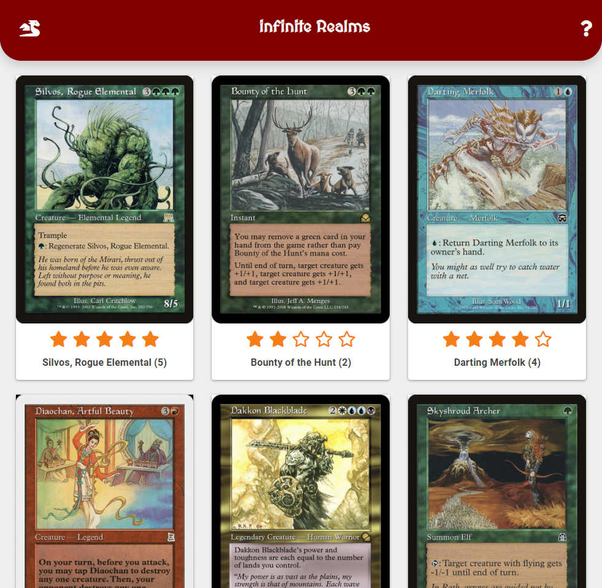

# infinite Realms
Nicholas La Monaco

## Description:

infinite Realms is a full-stack, mobile-first, progressive web application that uses Node.js, Express, MongoDB, and Mongoose with the Scryfall API to 
create a lazy-loading image gallery experience. 

## Deployed Site:
https://infiniterealms.herokuapp.com/

## Table of Contents

* [Installation](#installation)
* [Usage](#usage)

## Installation

Clone the repo, and install all dependencies 
```
npm install 
```
Next, in your terminal run 
```
mongod
```
Open a new terminal while it's running, and run:
```
> mongo
> use mtgPix
```
Open another terminal, navigate to the root directory, and run:
```
node server
```
You're now ready to endlessly scroll through old Magic cards...

## Usage
Gallery view
  
  
  

## Questions

Contact [Nlamonaco86](mailto:nlamonaco86@gmail.com) with any questions or suggestions!
