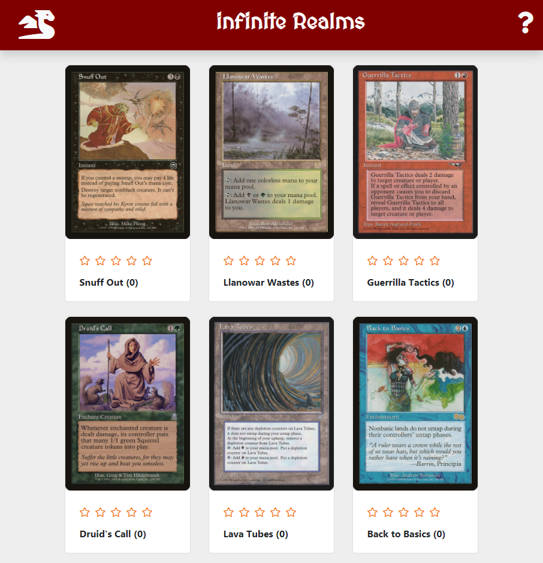

# infinite Realms
Nicholas La Monaco

## Description:

infinite Realms is a full-stack, mobile-first, progressive web application that uses Node.js, Express, MongoDB, and Mongoose with the Scryfall API to 
create a lazy-loading image gallery experience. 

## Deployed Site:
https://infiniterealms.herokuapp.com/

## Table of Contents

* [Installation](#installation)
* [Usage](#usage)

## Installation

Simply clone the repo, and/or visit the deployed page link to begin.

## Usage
Gallery view
  

## Questions

Contact [Nlamonaco86](mailto:nlamonaco86@gmail.com) with any questions or suggestions!
